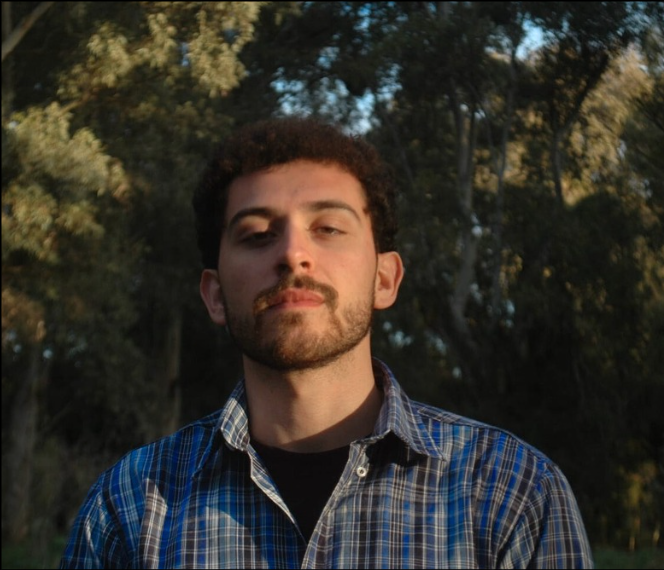
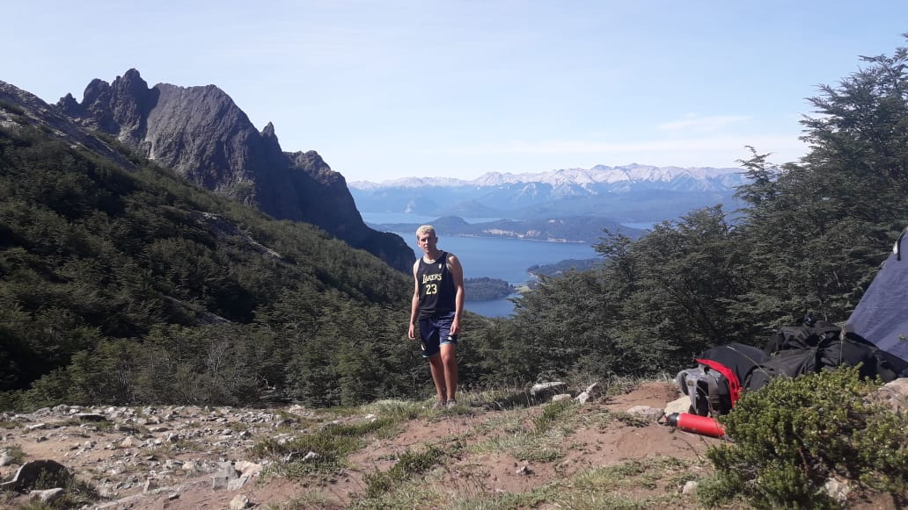

---
hide:
  - toc
  - navigation
---
<!--
CHECKLIST FOR THIS PAGE:
- [ ] Replace [YOUR NAME] with your full name (3 places)
- [ ] Replace [YOUR JOB TITLE] with your current or target role
- [ ] Replace [YOUR TAGLINE] with a short phrase describing your focus
- [ ] Rewrite the About Me paragraph with your own words
- [ ] Replace assets/images/profile.png with your actual photo (keep the filename or update it below)
- [ ] Replace assets/images/about.png with your own image (a field photo, map, or workspace shot)
- [ ] Edit the skill cards to match your actual skills (add, remove, or rename cards as needed)
- [ ] Update GitHub and LinkedIn links in the Connect section
- [ ] Add your CV PDF to docs/assets/ and update the filename in the Download CV button
-->

  
  <h1><strong>Luciano Rivas</strong></h1>
  
<strong>Biologist</strong>

  
<em>Wildlife ecologist | Biodiversity data | GIS & remote sensing | R & Python</em>

---

## About Me

I am an ecologist working at the intersection of biodiversity conservation, landscape ecology, GIS, remote sensing, and GeoAI. My projects integrate satellite imagery, ecological field data, vegetation and soil indicators, and machine-learning workflows to assess land-use dynamics, ecological connectivity, and biodiversity responses in agricultural, urban landscapes, and protected areas.

I mainly work with Python, R, Google Earth Engine, and open-source GIS tools, and I am currently seeking opportunities in biodiversity and landscape analysis in Europe and Argentina.

  

---

[View My Projects :material-arrow-right:](projects/index.md){ .md-button .md-button--primary }
[Download CV :material-download:](assets/Luciano_Rivas_Academic_CV (1).pdf){ .md-button }

---

## Skills

-   :material-layers:{ .lg .middle } **GIS & Remote Sensing**

    ---

    - QGIS, Google Earth Engine, RStudio, Python
    - Spatial analysis, raster processing, and map design
    - Land-use / land-cover analysis and reclassification
    - NDVI, temperature, and environmental raster extraction
    - Habitat suitability, ecological connectivity, and least-cost analysis
    - QGIS Model Designer and basic PyQGIS workflows

-   :material-code-braces:{ .lg .middle } **Programming & Data Analysis**

    ---

    - R — `sf`, `terra`, `ggplot2`, `dplyr`, `survival`
    - Python — `pandas`, `NumPy`, `Matplotlib`, `pathlib`, `shutil`
    - Ecological statistics and reproducible workflows
    - Data cleaning, visualization, and exploratory analysis
    - Git, GitHub, PowerShell, and command-line workflows

-   :material-star-four-points:{ .lg .middle } **Machine Learning & GeoAI**

    ---

    - YOLO object detection for camera-trap imagery
    - Image annotation with MakeSense.ai
    - Species detection from images and video inference
    - Pilot workflows for ecological computer vision
    - GeoAI-assisted spatial analysis and biodiversity mapping
    - Model limitations, validation needs, and ecological interpretation

-   :material-earth:{ .lg .middle } **Landscape Ecology & Conservation**

    ---

    - Ecological connectivity and corridor planning
    - Wildlife movement analysis and habitat use modelling
    - Step Selection Functions with GPS tracking data
    - Biodiversity monitoring in protected and productive landscapes
    - Human-modified landscapes, habitat fragmentation, and land-use change
    - Conservation-oriented spatial planning

-   :material-database:{ .lg .middle } **Ecological & Field Data**

    ---

    - Camera-trap data organization and species monitoring
    - Vegetation, soil, and biodiversity indicators
    - Soil health analysis in agricultural landscapes
    - Non-invasive genetic sampling for carnivore studies
    - Fieldwork in Patagonia and protected areas
    - Data integration from field surveys, remote sensing, and GIS layers

-   :material-chart-line:{ .lg .middle } **Scientific Communication**

    ---

    - Academic writing and literature synthesis
    - Peer-reviewed publications in wildlife ecology and invasive species
    - Scientific posters and conference presentations
    - Portfolio project documentation in Markdown and Jupyter Notebook
    - Map-based storytelling and data visualization
    - Technical communication for conservation and applied ecology

---

## Connect

[GitHub](https://github.com/luchorivas991-Ecology){ .md-button }
[LinkedIn](https://linkedin.com/in/luciano-rivas-620305200){ .md-button }
