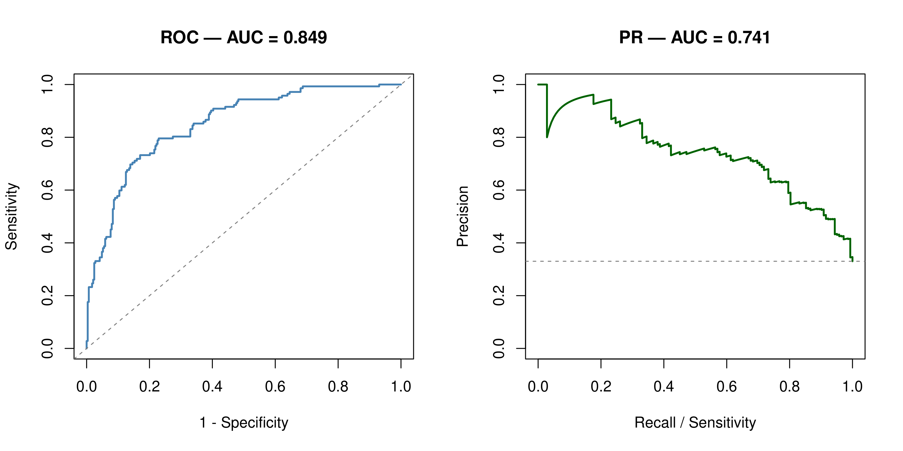

# Strange-tailed Tyrant habitat suitability

This project maps potential habitat suitability for the globally threatened Strange-tailed Tyrant (*Alectrurus risora*) in northeastern Argentina and adjacent areas using a spatially evaluated Random Forest species distribution model.

## Objective

The goal was to identify areas with potentially suitable environmental conditions for *A. risora* and produce maps that can support field-survey planning and preliminary regional conservation assessments.

## Workflow

- GBIF occurrence-data preparation and spatial thinning
- Definition of a calibration area using the occurrence convex hull and a 50-km buffer
- Preparation of land-cover and climatic predictors
- Aggregation to a common 1-km grid
- Sampling of pseudoabsences within the calibration area
- Spatial partitioning using 75-km blocks
- Random Forest fitting and internal spatial validation
- Production of continuous and binary habitat-suitability maps

## Model and data

The model used 476 presence records and 952 pseudoabsences. Six predictors represented grassland, tree-cover and herbaceous-wetland proportions, annual mean temperature, annual precipitation and precipitation seasonality. Land-cover variables were derived from ESA WorldCover 2021, while climatic predictors were obtained from WorldClim V1.

## Key findings

- ROC-AUC: **0.849**
- PR-AUC: **0.741**
- Sensitivity: **85.2%**
- Specificity: **63.5%**
- Classification threshold: **0.202**
- Potentially suitable area: **59,235 km²** (**28.02%** of the modeled area)

The continuous map shows variation in predicted environmental suitability, while the binary map identifies cells classified as potentially suitable above the selected threshold. These predictions represent environmental suitability and do not confirm species occupancy.

*Predicted habitat suitability for the Strange-tailed Tyrant at 1-km resolution. The continuous and binary outputs use the same calibration area and environmental baseline.*

*ROC and precision–recall curves calculated on the spatially reserved evaluation set.*

## Interpretation and limitations

The maps are intended as regional screening products for identifying areas that warrant further field investigation. Results remain conditional on occurrence sampling bias, pseudoabsence selection, the definition of the calibration area and the spatial evaluation design. The model was not projected to future climate conditions.

## Tools

`R` `Random Forest` `terra` `Google Earth Engine` `QGIS` `Species Distribution Modelling` `Remote Sensing`

## Links

[View Code on GitHub](https://github.com/luchorivas991-Ecology/Alectrurus-risora-SDM){.md-button}
