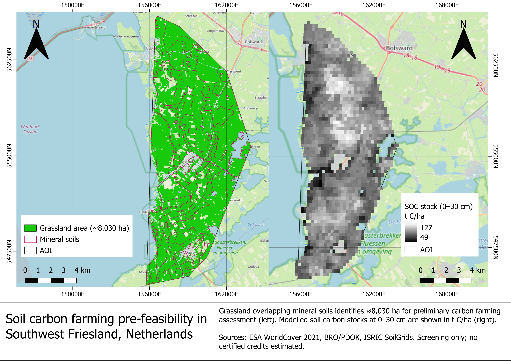

# Soil carbon farming pre-feasibility in Southwest Friesland

**A preliminary spatial assessment of grassland and soil organic carbon to support carbon farming project development in the Netherlands.**

## Objective

Identify grassland overlapping mapped mineral soil units and describe existing soil organic carbon (SOC) stocks as an initial step toward evaluating a carbon farming project.

The assessment uses the European Carbon Removals and Carbon Farming Certification Framework (CRCF) as a reference for project development. It does not establish certification eligibility or generate carbon credits.

## Workflow

1. Define the study area in southwest Friesland.
2. Map grassland using **ESA WorldCover 2021**.
3. Classify soil units using the Dutch **BRO soil map**.
4. Identify grassland overlapping mineral soil groups, separating peat and organic-rich soil groups.
5. Summarise **SoilGrids SOC stocks at 0–30 cm** and produce a two-panel map in QGIS.

**Tools:** Google Earth Engine · QGIS · Spatial analysis · Zonal statistics

## Main results

Approximately **8,030 ha** of grassland overlap soil groups selected for preliminary mineral-soil screening.

| Soil group | Grassland area (ha) | Mean SOC stock (t C/ha)* |
|---|---:|---:|
| Marine clay soils | 7,200.77 | 89.9 |
| Calcareous sandy soils | 585.07 | 85.0 |
| Podzol soils | 221.40 | 85.2 |
| Glacial till soils | 22.54 | 82.9 |
| **Total screening area** | **8,029.78** | — |

*SOC means describe valid SoilGrids pixels across each mapped soil group, not exclusively its grassland.*

The **left panel** shows grassland and mapped mineral soil units used for screening. The **right panel** displays modelled SOC stocks, ranging from **49 to 127 t C/ha** across the study area.

## Connection to carbon project development

A potential follow-up would evaluate improved grassland management, such as sward diversification and adjusted fertiliser management.

Developing this concept into a carbon project would require:

- **Baseline:** document current management and expected emissions and removals without the project.
- **Additionality:** demonstrate that proposed improvements go beyond the baseline and applicable requirements.
- **Monitoring and verification:** establish field soil sampling, management records and repeated measurements under an applicable methodology.

CRCF is an EU framework for voluntary certification; this assessment does not demonstrate eligibility for EU ETS compliance.

## Limitations

SoilGrids provides modelled stocks at approximately **250 m resolution**. Existing carbon stocks are not estimates of additional sequestration or tradable credits.

Mapped soil groups provide a screening proxy: organic horizons, current management and site eligibility require field verification. This project is a desktop pre-feasibility exercise.

## Data sources

- [ISRIC SoilGrids](https://soilgrids.org/) — soil organic carbon stocks, 0–30 cm.
- [ESA WorldCover 2021](https://doi.org/10.5281/zenodo.7254221) — land cover at 10 m resolution.
- [BRO Bodemkaart / PDOK](https://www.pdok.nl/introductie/-/article/bro-bodemkaart-sgm-) — Dutch soil map.
- [EU CRCF Regulation](https://eur-lex.europa.eu/eli/reg/2024/3012/oj/eng) — certification framework.
- © [OpenStreetMap contributors](https://www.openstreetmap.org/copyright) — basemap.

© ESA WorldCover project 2021 / Contains modified Copernicus Sentinel data (2021) processed by ESA WorldCover consortium