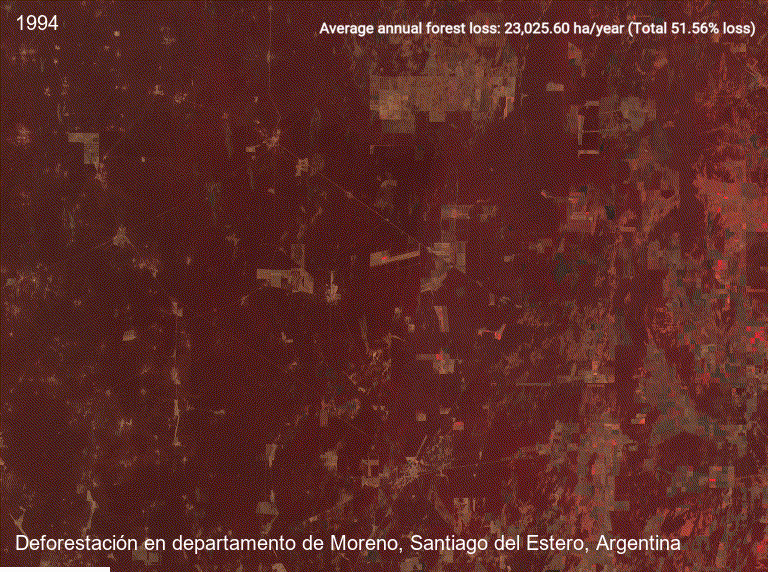
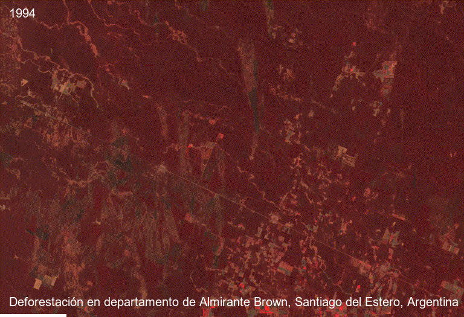

# Argentinian Chaco land-use change visualization

This project presents animated spatial visualizations of native forest loss and agricultural expansion in two highly degraded municipalities of the Argentinian Chaco between 1994 and 2023.

## Objective

The goal was to transform geospatial outputs into clear visual material for communicating long-term land-use change, deforestation intensity, and the spatial expansion of agricultural land.

## Workflow

- Land-cover data preparation
- Forest class reclassification
- Municipality-level clipping
- Zonal summaries by department
- Animated map production
- Visual communication of deforestation patterns

## Key findings

**Moreno**
Forest loss: 667,742 ha
Relative loss: 51.6%
Average annual loss: 23,026 ha/year

**Almirante Brown**
Forest loss: 492,913 ha
Relative loss: 29.7%
Average annual loss: 16,997 ha/year

## Tools

`QGIS` `PyQGIS` `Remote Sensing` `Land-use Change` `Data Visualization`

## Links

[View Code on GitHub](https://github.com/luchorivas991-Ecology/Chaco-deforestation.git){.md-button}