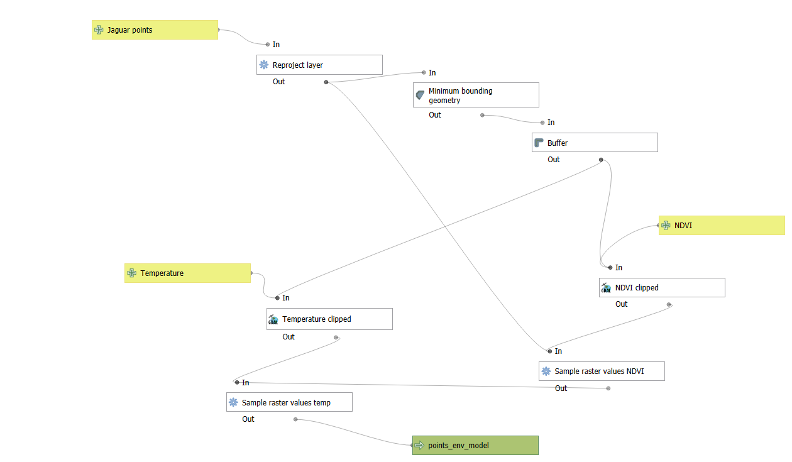
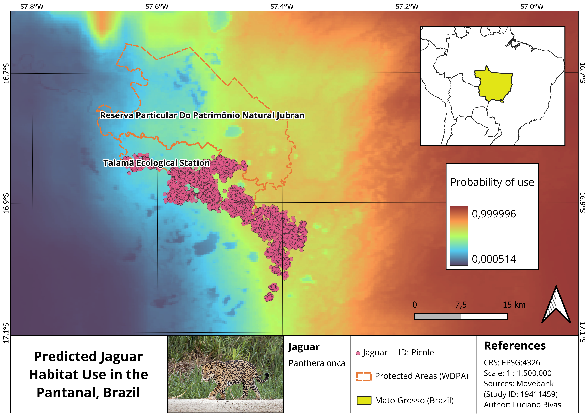

# Jaguar habitat use modelling in the Brazilian Pantanal

## Overview

This project combines **QGIS** and **RStudio** to model habitat use of a jaguar (*Panthera onca*) individual in the Brazilian Pantanal using GPS tracking data.

The movement data were obtained from Morato et al. (2016), using tracking records from **October 2013 to March 2014**. The main goal was to evaluate how environmental conditions influence jaguar habitat use at the movement level.

**Research question:**  
What drives jaguar habitat use at the movement level?

To answer this question, I used a **Step Selection Function (SSF)** approach. This method compares locations used by the jaguar with alternative available movement steps, and then links those movement decisions to environmental predictors such as NDVI and temperature.

**Study system:** Jaguar movement ecology  
**Species:** *Panthera onca*  
**Study area:** Brazilian Pantanal  
**Period:** October 2013 – March 2014  
**Main workflow:** QGIS Model Designer + RStudio  
**Main analysis:** Step Selection Function  
**Status:** Portfolio project  

---

## Methods & Tools

**Data sources**

- Jaguar GPS tracking data from Morato et al. (2016)
- NDVI raster data
- Temperature raster data

**Processing steps**

1. Prepared jaguar GPS tracking data.
2. Generated observed movement steps from tracking locations.
3. Generated available/random steps for comparison.
4. Extracted NDVI and temperature values using QGIS Model Designer.
5. Linked used and available steps with environmental predictors.
6. Fitted a Step Selection Function in RStudio.
7. Predicted habitat use probability across the landscape.
8. Designed a final map showing spatial variation in predicted habitat use.

**Tools used**

| Tool | Purpose |
|---|---|
| QGIS | Spatial data processing and map design |
| QGIS Model Designer | Automated extraction of NDVI and temperature values |
| RStudio | Statistical analysis and SSF modelling |
| `clogit` | Conditional logistic regression |
| Raster data | Environmental predictors |
| GPS tracking data | Jaguar movement analysis |

---

## QGIS processing workflow

The environmental extraction workflow was automated using **QGIS Model Designer**. This allowed me to extract NDVI and temperature values from raster layers for both used and available movement steps.



This step connected the movement dataset with environmental predictors, making it possible to test whether jaguar movement decisions were associated with greener areas and thermal conditions.

---

## Step Selection Function analysis

A **Step Selection Function** compares the environmental characteristics of locations actually used by the animal with alternative locations that were available but not used.

In this project, used and available steps were compared using environmental predictors and movement-related variables such as:

- NDVI
- Temperature
- Step length
- Movement direction

The model was fitted in RStudio using conditional logistic regression. This approach allowed the analysis to focus on habitat selection at the movement-step level, rather than only describing where the animal was observed.

```r
# Conceptual structure of the SSF model

ssf_model <- clogit(
  case_ ~ ndvi + temperature + step_length + direction + strata(step_id),
  data = jaguar_steps
)
```

---

## Spatial prediction

After fitting the SSF model, the estimated relationships were used to generate a spatial prediction of habitat use probability across the study area.

The final map shows areas with higher and lower predicted probability of use by the jaguar, based on the environmental conditions included in the model.


---

## Key Findings

The model suggested that this jaguar individual showed:

- Higher probability of use in greener areas, represented by higher NDVI values.
- Lower probability of use in areas with higher temperature values, suggesting possible avoidance of hotter areas.
- Strong movement constraints related to step length and movement direction.

Overall, the results suggest that jaguar habitat use at the movement level was shaped by both environmental conditions and movement behaviour.

---

## Conservation relevance

This type of workflow is useful for applied conservation because it links animal movement data with spatial environmental predictors.

Potential applications include:

- Identifying important habitat patches.
- Supporting protected area planning.
- Mapping potential ecological corridors.
- Evaluating how temperature and vegetation conditions influence movement.
- Anticipating the effects of climate change on habitat use.
- Scaling the analysis to multiple individuals or broader landscapes.

---

## Limitations

This project should be interpreted as a movement ecology modelling exercise based on one jaguar individual.

The main limitations were:

- The analysis focused on a single individual.
- The time period was limited to October 2013 – March 2014.
- Environmental predictors were limited to NDVI and temperature.
- Further validation would be needed before applying the results to broader conservation planning.
- Future models should include multiple individuals and additional predictors such as land cover, distance to water, human disturbance, and protected area boundaries.


---

## Tools and technologies

`QGIS` `QGIS Model Designer` `RStudio` `Step Selection Function` `clogit` `GPS Tracking` `Remote Sensing` `NDVI` `Temperature` `Movement Ecology` `Habitat Use Modelling`

---

## Repository

[View project repository](https://github.com/luchorivas991-Ecology/jaguar-ssf-model.git)

---

## Reference

Morato, R. G., Stabach, J. A., Fleming, C. H., Calabrese, J. M., De Paula, R. C., Ferraz, K. M. P. M., Kantek, D. L. Z., Miyazaki, S. S., Pereira, T. D. C., Araujo, G. R., et al. (2016). Space use and movement of a neotropical top predator: the endangered jaguar. *PLOS ONE, 11*(12), e0168176.  
https://doi.org/10.1371/journal.pone.0168176

---

[Back to top](#jaguar-habitat-use-modelling-in-the-brazilian-pantanal)