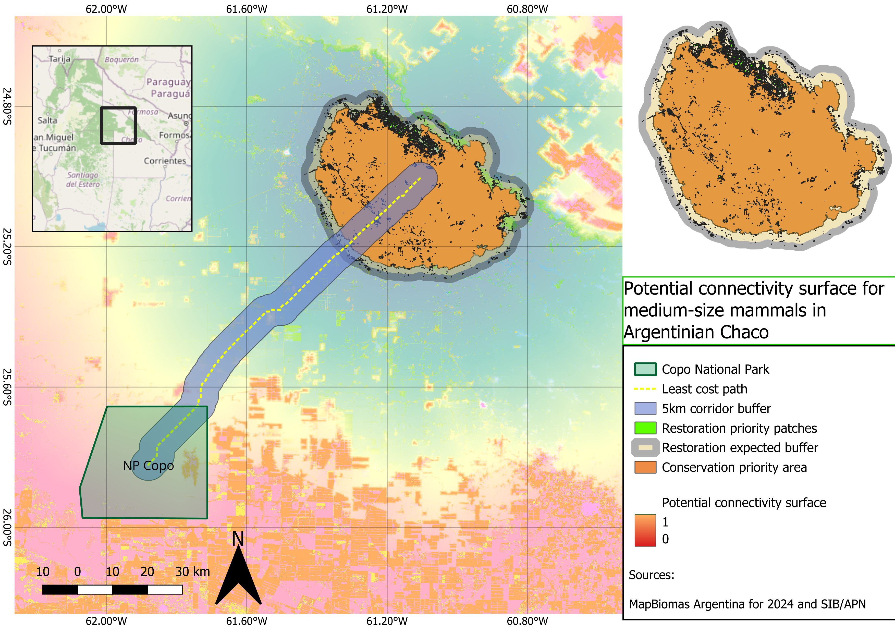
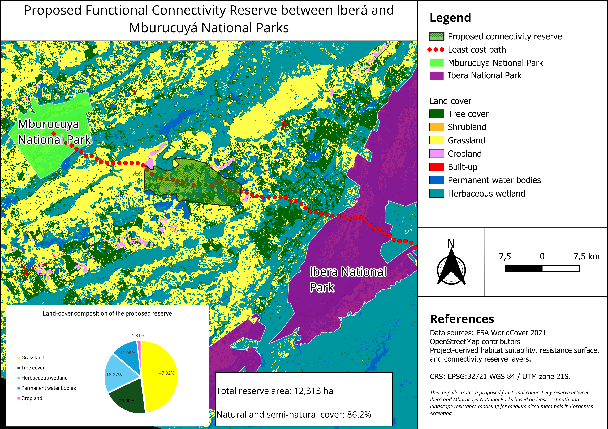

---
hide:
  - toc
  - navigation
---

# Projects

A selection of my projects. Click any card to see the full write-up.

**[Potential connectivity surface for medium-sized mammals in the Argentine Chaco](gran_chaco_connectivity_portfolio.md)**

This project models potential functional connectivity for medium-sized to large forest-associated mammals in the Argentine Chaco using a reproducible GIS workflow.

`Python` `QGIS` `Connectivity` `Conservation Planning`

[View Project →](gran_chaco_connectivity_portfolio.md){ .md-button }

**[Landscape Connectivity Analysis](project1.md)**

Built a proposed natural reserve to increase medium-sized mammal connectivity between two existing National Parks in Corrientes, Argentina using a least-cost path approach.

`GEE` `QGIS` `RStudio`

[View Project →](project1.md){ .md-button }

<video controls width="100%">
  <source src="../assets/images/Video%20Project%202a.mp4" type="video/mp4">
  Your browser does not support the video tag.
</video>

**[AI species detection](YOLO_AI.md)**

I trained a pilot YOLO species detection model using ocelot, paca, and red fox camera-trap images.

`YOLO` `AI` `PowerShell` `Python`

[View Project →](YOLO_AI.md){ .md-button }

**[Argentinian Chaco land-use change visualization](deforestation.md)**

Animated spatial visualization of native forest loss and agricultural expansion in two highly degraded municipalities of the Argentinian Chaco between 1994 and 2023.

`QGIS` `PyQGIS` `Remote Sensing` `Land-use Change` `Data Visualization`

[View Project →](deforestation.md){ .md-button }

**[Jaguar habitat use in the Brazilian Pantanal](habitat_use_jaguar.md)**

I modelled habitat use of a jaguar individual in the Brazilian Pantanal using GPS tracking data, QGIS Model Designer, and a Step Selection Function in RStudio.

`QGIS` `RStudio` `SSF` `GPS Tracking` `Movement Ecology`

[View Project →](habitat_use_jaguar.md){ .md-button }

